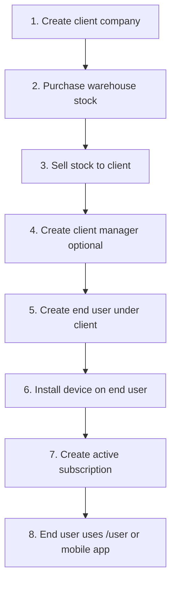

# Device onboarding — web panel guide

This document describes the **full web workflow** to onboard a GPS device for a fleet end user in BillX GPS. It is based on the current Laravel admin/client panels, stock ledger, and subscription billing code.

**Scope:** Web only (`/admin`, `/client`, `/user`). Mobile app login is separate; end users need an account and active subscription created through this flow first.

---

## Who does what

| Role | Panel URL | Responsibilities in onboarding |
|------|-----------|--------------------------------|
| **Super Admin** | `/admin` | Everything: clients, warehouse stock, stock sales, plans, users, devices, subscriptions |
| **Admin** (vendor staff) | `/admin` | Same modules, but only for **assigned clients** (`admin_client_scopes`) |
| **Client** (fleet/company manager) | `/client` | End users, devices, subscriptions, invoices for **their company** — **cannot** buy warehouse stock or issue stock sales |
| **End User** (`user`) | `/user` | Views own devices, live map, alerts — **no** onboarding actions |

> **Important:** Public self-registration at `/register` creates a standalone end-user account. It does **not** attach the user to a client, assign devices, or create subscriptions. For B2B fleet onboarding, always create end users from **Admin → Users** or **Client → Users**.

---

## Big picture (correct order)



Each step has hard checks in code — skipping or reordering steps will block the next one.

---

## Step 1 — Register the client company

**Who:** Super Admin or Admin  
**Where:** Admin → **Clients** → Create (`/admin/clients/create`)  
**Permission:** `clients.manage`

### What you enter
- Company name, slug (optional), status (`active` / `inactive`)
- **Can track maps** — allows the client manager to open live maps for fleet end users

### What the system does
- Creates a row in `clients`
- Vendor **Admin** who creates the client is auto-scoped to manage it (unless Super Admin)

### Alternative: create client via “Client” user
Admin → **Users** → Create with role **Client**:
- If no existing client is selected, the system **auto-creates** a `clients` row using the user’s name
- Links the user as **owner** in `client_members`

### Cross-check
| Check | Enforced by |
|-------|-------------|
| Client must exist before stock sale | `device_stock_sales.client_id` FK |
| Client must be `active` for map tracking | `Client::allowsMapTracking()` |

---

## Step 2 — Client must have stock (warehouse first)

Stock is a **two-level** model:

1. **Warehouse** — devices you purchased from suppliers  
2. **Client** — units sold/transferred to a client company (available to install)

**Client managers cannot add stock themselves.** Only Admin panel users with `stock.manage` can.

### 2a. Purchase warehouse stock

**Who:** Super Admin / Admin  
**Where:** Admin → **Device stock** → Create (`/admin/device-stock`)  
**Permission:** `stock.manage`

Record a purchase order (`device_stock_orders`): device type, brand/model, quantity, unit cost, supplier, etc.

On save, `InventoryService::recordPurchaseFromOrder()` increases **warehouse** `available_qty`.

### 2b. Sell / transfer stock to the client

**Who:** Super Admin / Admin  
**Where:** Admin → **Device stock sales** → Create (`/admin/device-stock-sales/create`)  
**Permission:** `stock.manage`

Select:
- **Client company**
- **Warehouse stock order** (must have available quantity, not faulty/repair)
- **Quantity** to transfer

On save:
- Invoice `device_stock_sales` is created (`status = issued`)
- Warehouse stock decreases (FIFO)
- **Client stock increases** for that device type

### How “client stock balance” is calculated

`ClientStockBalanceService` computes per client:

```
available = sold_to_client − installed_devices
```

- **Sold** = sum of issued stock sale line items for that client (by device type)
- **Installed** = devices linked in `client_devices` for that client (by device type)

View balances:
- Admin → Clients → stock balance (`/admin/clients/{id}/stock-balance`)
- Admin → Device stock sales (filter by client)
- Client panel → **Stock balance** (`/client/stock-balance`)
- Client panel → **Purchases** (`/client/purchases`) — sale invoices

### Cross-check
| Check | Error if failed |
|-------|-----------------|
| Warehouse has enough units | “Warehouse stock insufficient” |
| Cannot sell faulty/repair stock | Validation on sale form |
| Client has `available > 0` for device type | “No client stock available for this device type” at device install |

---

## Step 3 — Create the client manager (optional but typical)

**Who:** Super Admin / Admin  
**Where:** Admin → **Users** → Create  
**Permission:** `users.manage`

- Role: **Client**
- Link to the client company (or auto-create company as in Step 1)
- Optional: **Can track maps** permission (`maps.view`)

Client managers log in at `/client` and can onboard end users and devices **only for their company**.

**Client panel cannot:** manage warehouse stock, create stock sales, or manage subscription plans.

---

## Step 4 — Register the end user under the client

**Who:** Super Admin, Admin, or Client manager  
**Where:**
- Admin → **Users** → Create (`/admin/users/create`)
- Client → **Users** → Create (`/client/users/create`)

**Permission:** `users.manage`

### Required fields
- Name, email, password
- Role: **End User** (`user`) — forced on client panel
- **Client company** — required on admin panel for end users
- Status: `active`

### What the system does
- Creates `tc_users` with `laravel_role = user`
- Inserts `client_members` linking user → client
- Provisions Traccar user (if Traccar mode is active)

### Cross-check
| Check | Enforced when |
|-------|---------------|
| End user must belong to selected client | `assertUserBelongsToClient()` on device create/update |
| Client panel only lists end users | `scopeEndUsersOnly()` on user index |

> Public `/register` is **not** part of this B2B flow unless an admin later links that user to a client and assigns devices.

---

## Step 5 — Install the device (onboard hardware)

**Who:** Super Admin, Admin, or Client manager  
**Where:**
- Admin → **Devices** → Create (`/admin/devices/create`)
- Client → **Devices** → Create (`/client/devices/create`)

**Permission:** `devices.manage`

### Required fields
- **Client company** (auto on client panel)
- **Owner (end user)** — must be a member of that client
- **IMEI** (unique)
- **Device type** — only types with **available client stock** are offered (unless editing existing device)
- Vehicle details, SIM, status, etc.

### What the system does (in order)
1. `ClientStockBalanceService::assertCanInstall()` — client must have stock for that type  
2. Creates `tc_devices` and links owner via `tc_user_device`  
3. Assigns device to client in `client_devices`  
4. `InventoryService::consumeForInstall()` — decrements client stock by 1  
5. Provisions device in Traccar (if enabled)

### Cross-check
| Check | Result |
|-------|--------|
| No client stock for type | Form blocked / validation error |
| End user not in client | “The selected user does not belong to this client.” |
| Duplicate IMEI | Validation error on create |

**At this point:** the device exists and is linked to the end user, but **live map / tracking may still be blocked** until Step 6.

---

## Step 6 — Create an active subscription

**Who:** Super Admin, Admin, or Client manager  
**Where:**
- Admin → **Subscriptions** → Create
- Client → **Subscriptions** → Create

**Permission:** `subscriptions.manage`

### Prerequisites
- Subscription **plan** must exist (Admin → **Subscription plans**, `billing.manage`)
- Device must already belong to the selected client
- Device must **not** already have another active subscription

### Required on create
- Client → Device → Plan  
- **Start date**  
- **Status** — use `active` for immediate map access  
- **Subscription type** — `new` includes device selling price on end-user invoice; renewals differ  
- **End-user selling price** (what the client charges the fleet user)  
- **Device selling price** (required for `new` subscriptions)

### What the system does
1. Creates `subscriptions` with plan dates (`ends_at` from plan billing cycle)  
2. Creates two invoices (`SubscriptionBillingService::provisionForSubscription`):
   - **Platform invoice (`PINV-*`)** — vendor bills the **client** (plan company price only)
   - **Client invoice (`CINV-*`)** — client bills the **end user** (subscription + device selling price for new installs)
3. If status is `active`, ensures stock is committed (idempotent if already consumed at install)

### Cross-check
| Check | Enforced by |
|-------|-------------|
| Device belongs to client | `deviceBelongsToClient()` |
| One active subscription per device | Duplicate check in `SubscriptionController::validated()` |
| Active subscription for map | `DeviceSubscriptionService::isActive()` |

### Optional: mark end-user invoice paid
On the subscription form or subscription list, client managers can mark the **client invoice** paid (`subscriptions.client-invoice.pay`). Platform invoice payments require `billing.manage` (admin).

---

## Step 7 — End user uses the service

**Where:** `/user` (web) or mobile app

The end user logs in with the account created in Step 4 and sees devices where:
- They are linked in `tc_user_device`
- Device belongs to their client (`client_devices`)
- Device has an **active, non-expired** subscription
- Device status is not blocked

If subscription is missing or inactive, map access shows a resubscribe message (`DeviceSubscriptionService`).

---

## Quick reference — admin URLs

| Action | URL |
|--------|-----|
| Clients | `/admin/clients` |
| Client stock balance | `/admin/clients/{id}/stock-balance` |
| Warehouse stock | `/admin/device-stock` |
| Sell stock to client | `/admin/device-stock-sales` |
| Users | `/admin/users` |
| Devices | `/admin/devices` |
| Subscription plans | `/admin/subscription-plans` |
| Subscriptions | `/admin/subscriptions` |
| Billing invoices | `/admin/billing-invoices` |
| Profit & loss | `/admin/reports/profit-loss` |

## Quick reference — client panel URLs

| Action | URL |
|--------|-----|
| Dashboard | `/client` |
| End users | `/client/users` |
| Devices | `/client/devices` |
| Subscriptions | `/client/subscriptions` |
| Stock balance | `/client/stock-balance` |
| Purchase history | `/client/purchases` |
| Invoices | `/client/billing-invoices` |

---

## Common mistakes (troubleshooting)

| Symptom | Likely cause | Fix |
|---------|--------------|-----|
| Cannot create device — no stock | No stock sale to client for that device type | Admin → Device stock sales → transfer units to client |
| Cannot select end user on device form | User not linked to client | Create/edit user with correct client in `client_members` |
| Device created but no map | No active subscription | Create subscription with status `active` and valid dates |
| “Already has active subscription” | Renew instead of new row | Use subscription **renew** or wait until expired/cancelled |
| Client manager cannot sell stock | By design — no `stock.manage` on client role | Use admin panel for warehouse + sales |
| Self-registered user sees nothing | No client/device/subscription | Use admin/client onboarding flow instead |

---

## Related documentation

- [MULTI_TENANT_RBAC.md](./MULTI_TENANT_RBAC.md) — roles, tenants, permissions  
- [SAAS_BILLING.md](./SAAS_BILLING.md) — invoices, plans, profit reporting  
- [PRODUCTION_DEPLOY.md](./PRODUCTION_DEPLOY.md) — production setup  

---

## Minimum happy-path checklist

Use this when onboarding a new fleet customer end-to-end:

- [ ] Client company created (`active`)
- [ ] Warehouse stock purchased (device type + quantity)
- [ ] Stock sale issued to client (quantity ≥ devices to install)
- [ ] Client manager account created (optional)
- [ ] End user created under client (`active`)
- [ ] Device installed: IMEI, type, assigned to end user (stock consumed)
- [ ] Active subscription created for that device
- [ ] End user logs in and sees device on map
